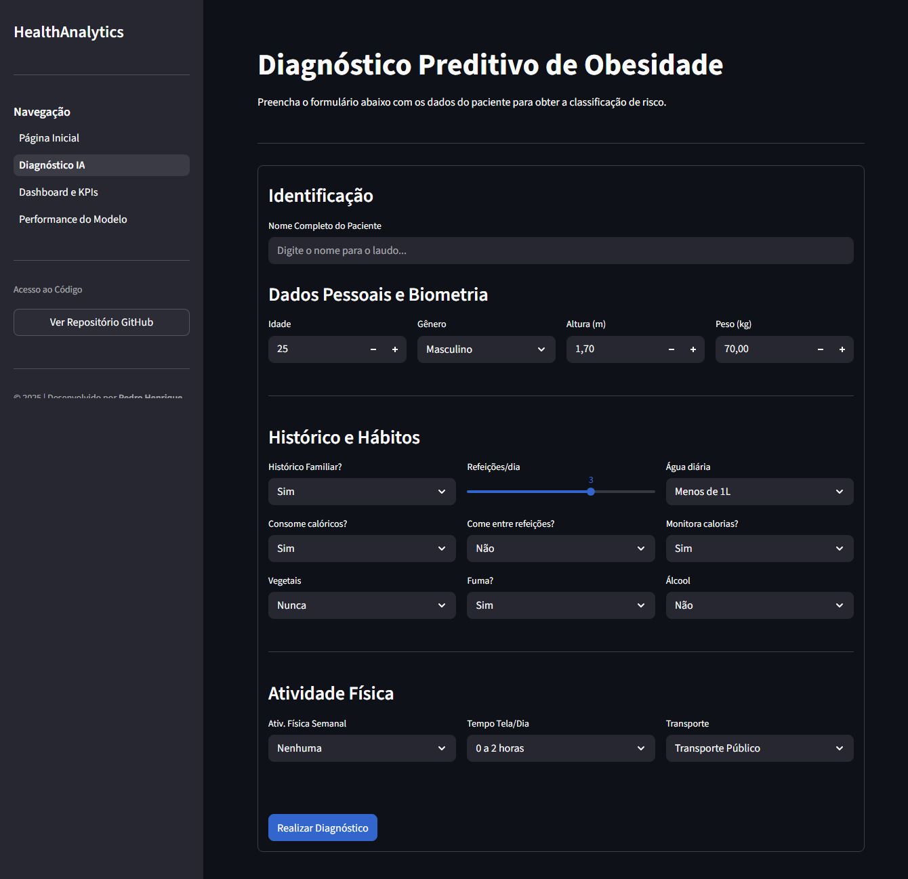

# HealthAnalytics: Predição de Obesidade com IA Explicável

[](https://opensource.org/licenses/MIT)
[](https://obesity-risk-app.streamlit.app/)


> **Tech Challenge - Fase 4 | Data Analytics**
> Sistema inteligente para apoio ao diagnóstico clínico, análise de saúde preventiva e geração de laudos automatizados.

---

## Acesso à Aplicação
Acesse a aplicação online clicando no link abaixo:
### [**HealthAnalytics Live Demo**](https://obesity-risk-app.streamlit.app/)

---

## Visão Geral do Projeto

| Diagnóstico Preditivo |
|:---:|
|  |
| *Previsão de risco com IA e geração de PDF* |

---

## Sobre o Projeto

Este projeto tem como objetivo auxiliar profissionais de saúde na **identificação precoce de riscos relacionados à obesidade**. Diferente de calculadoras de IMC comuns, este sistema utiliza Machine Learning para analisar padrões comportamentais e genéticos.

O diferencial é o uso de **Explainable AI (SHAP)**, que não apenas classifica o paciente, mas explica matematicamente **por que** aquela decisão foi tomada, aumentando a confiança no diagnóstico.

### Principais Entregáveis:
1.  **Diagnóstico Preditivo (IA):** Classificação do nível de obesidade com base em bioimpedância e hábitos.
2.  **Laudo Médico Inteligente:** Geração automática de PDF com anamnese, diagnóstico, fatores de risco e sugestões de saúde.
3.  **Dashboard de BI:** Visualização interativa de dados históricos para estudos populacionais.
4.  **Auditoria de Modelo:** Área técnica para validação de métricas (Acurácia, F1-Score, Matriz de Confusão).

---

## Funcionalidades

### 1. Diagnóstico e XAI (Explainable AI)
* **Formulário Interativo:** Coleta intuitiva de dados do paciente.
* **Interpretabilidade (SHAP):** Gráficos que mostram exatamente quanto cada hábito (ex: consumo de água, sedentarismo) contribuiu para o aumento ou redução do risco.
* **Feedback Imediato:** Sugestões de saúde baseadas nos riscos identificados.

### 2. Dashboard Analítico
* **Filtros Dinâmicos:** Segmente a população por idade, gênero, hábitos, etc.
* **Mapas de Calor:** Correlação entre hábitos alimentares e níveis de obesidade.
* **Feature Importance:** Visualização global das variáveis mais impactantes.

### 3. Engenharia de Software
* **Docker:** Aplicação containerizada para fácil deploy em qualquer ambiente.
* **Pipeline Scikit-Learn:** Pré-processamento robusto (OneHotEncoding, OrdinalEncoding) integrado ao modelo.

---

## Estrutura do Projeto

```text
Obesity/
│
├── .streamlit/                 # Configuração de tema
├── assets/                     # Imagens, logos e prints
├── data/                       # Base de dados (obesity.csv)
├── notebooks/                  # Estudos e treinamento (Jupyter)
├── pages/                      # Páginas da Aplicação
│   ├── 1_Diagnostico_Preditivo.py
│   ├── 2_Dashboard_Analitico.py
│   └── 3_Performance_do_Modelo.py
├── saved_model/                # Modelo treinado (.joblib)
├── .dockerignore               # Arquivos ignorados pelo Docker
├── .gitignore                  # Arquivos ignorados pelo Git
├── constants.py                # Dicionários e configurações globais
├── Dockerfile                  # Receita para construção do container
├── HealthAnalytics.py          # Entrypoint (Home)
├── README.md                   # Documentação
├── requirements.txt            # Dependências Python
└── utils.py                    # Funções auxiliares (Menu Lateral)
```

## Como Rodar Localmente

### 1. Clone o repositório

```bash
git clone [https://github.com/hpedroh/obesity.git](https://github.com/hpedroh/obesity.git)
cd obesity
```

### 2. Crie um ambiente virtual (opcional, mas recomendado):

```Bash
python -m venv venv
# Windows: venv\Scripts\activate
# Linux/Mac: source venv/bin/activate 
```

### 3. Instale as dependências:

```Bash
pip install -r requirements.txt
```

### 4. Execute a aplicação:

```Bash
streamlit run HealthAnalytics.py
```

## Opção B: Rodar com Docker (Recomendado)

### 1. Construa a imagem:

```bash
docker build -t health-analytics .
```

### 2. Rode o container:

```Bash
docker run -d -p 8501:8501 --name health-app health-analytics
```

### 3. Acesso no navegador

http://localhost:8501


## Métricas do Modelo
- Acurácia: 94%
- F1-Score (média): 0.93

## Tecnologias Utilizadas
- Python 3.11+
- Scikit-learn 1.5+
- SHAP 0.44+
- Streamlit 1.38+
- Plotly, Pandas, Numpy

## Licença

Este projeto está sob a licença MIT. Sinta-se à vontade para contribuir ou utilizar para fins educacionais.

<div align="center"> <p>Desenvolvido por <b>Pedro Henrique</b></p> <p><i>Tech Challenge - Data Analytics</i></p> </div>