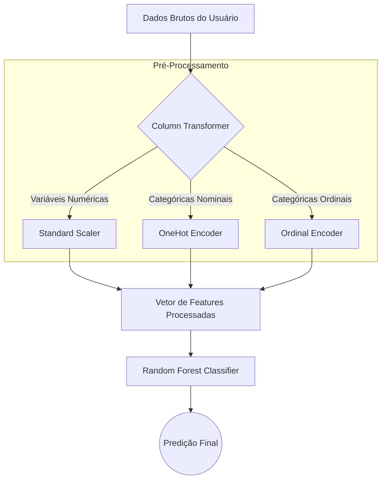
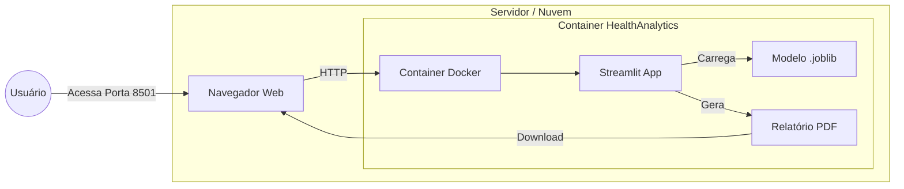

# :hammer_and_wrench: Detalhes Técnicos e Arquitetura

Documentação voltada para desenvolvedores que desejam manter ou expandir o HealthAnalytics.

## Estrutura de Arquivos

O projeto segue o padrão multipage do Streamlit.

```text
Obesity/
│
├── .streamlit/                 # Configuração de tema
├── assets/                     # Imagens, logos e prints
├── data/                       # Base de dados (obesity.csv)
├── docs/                       # Pasta com os arquivos .md da documentação
│   ├── index.md
│   ├── modeling.md
│   ├── installation.md
│   ├── user_guide.md
│   └── technical.md
├── notebooks/                  # Estudos e treinamento (Jupyter)
├── pages/                      # Páginas da Aplicação
│   ├── 1_Diagnostico_Preditivo.py
│   ├── 2_Dashboard_Analitico.py
│   └── 3_Performance_do_Modelo.py
├── saved_model/                # Modelo treinado (.joblib)
├── .dockerignore               # Arquivos ignorados pelo Docker
├── .gitignore                  # Arquivos ignorados pelo Git
├── constants.py                # Dicionários e configurações globais
├── Dockerfile                  # Receita para construção do container
├── HealthAnalytics.py          # Entrypoint (Home)
├── mkdocs.yml                  # Arquivo de configuração do site de doc
├── README.md                   # Documentação
├── requirements.txt            # Adicionar dependências do MkDocs
└── utils.py                    # Funções auxiliares (Menu Lateral)
```

## Stack Tecnológico

- Frontend: Streamlit (Python puro). Escolhido pela rapidez de desenvolvimento e suporte nativo a dados.
- Backend/ML: Scikit-Learn 1.5+.
- Visualização: Plotly (Gráficos interativos) e Matplotlib/SHAP (Gráficos estáticos de explicabilidade).
- Containerização: Docker (Debian Slim base para Python).

## Pipeline de Dados

O arquivo `modelo_obesidade.joblib` contém um Pipeline completo que processa os dados antes da predição:



### Componentes do Pipeline:

- OneHotEncoder: Aplicado em variáveis sem ordem intrínseca (ex: Gênero, Transporte).
- OrdinalEncoder: Aplicado em variáveis hierárquicas (ex: Consumo de Água, onde "Menos de 1L" < "Mais de 2L").
- Scaler: Normalização de dados numéricos para manter a escala (ex: Idade, Peso).
- Estimator: O classificador Random Forest que recebe o vetor denso final.

## Arquitetura de Execução

O diagrama abaixo ilustra como a aplicação é servida para o usuário final via Docker.



!!! failure "Ponto de Atenção"
    Ao alterar o `HealthAnalytics.py` ou criar novas páginas, lembre-se de importar `sidebar_navegacao` de `utils.py` para manter o menu consistente em todas as telas.