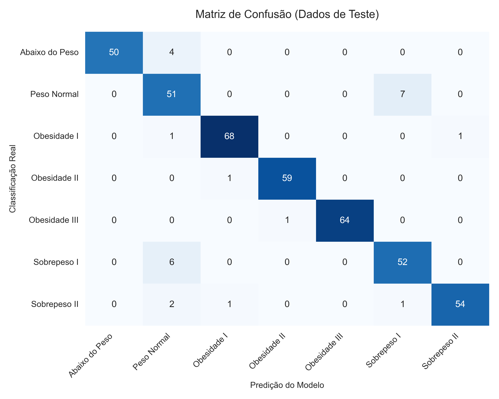

# :open_book: Manual de Utilização

Este guia ensina a navegar pelas três ferramentas principais do sistema.

## 1. Realizando um Diagnóstico (Clínico)

Acesse a página **"Diagnóstico Preditivo"** no menu lateral.

1.  **Preencha a Anamnese:** Insira os dados do paciente.
2.  **Processar:** Clique no botão `Realizar Diagnóstico`.
3.  **Interprete o Resultado:**
    * O sistema exibirá a classificação (ex: Obesidade Tipo I) no topo.
    * **Gráfico de Barras (SHAP):** As barras **vermelhas** são o que você deve aconselhar o paciente a mudar. As **verdes** são o que ele deve manter.
4.  **Exportar:** Clique em `Baixar Laudo PDF` para gerar o documento físico.

{: align=center width="700" }

!!! tip "Dica Prática"
    O PDF gerado já inclui "Sugestões de Hábitos" baseadas especificamente nos riscos encontrados. Use isso como base para sua prescrição médica.

---

## 2. Explorando Dados (Analista)

Acesse a página **"Dashboard Analítico"**. Esta área é para ver o "todo".

* **Filtros (Barra Lateral):**
    Use os filtros para responder perguntas como: *"Quantas mulheres com menos de 30 anos têm obesidade tipo II?"*. O dashboard se atualiza automaticamente.
* **Abas de Análise:**
    * **Visão Geral:** Métricas macro (Total de pacientes, médias).
    * **Fatores de Risco:** Veja correlações. Ex: O Mapa de Calor mostra se quem bebe mais álcool tende a ter peso maior.
    * **Explorador:** Crie seus próprios gráficos escolhendo os eixos X e Y.

{: align=center width="700" }

---

## 3. Auditando o Modelo (Técnico)

Acesse **"Performance do Modelo"**.
Use esta página para garantir que a IA não está "alucinando". Verifique a **Matriz de Confusão** para entender se o modelo está tendencioso para alguma classe específica.

{: align=center width="600" }